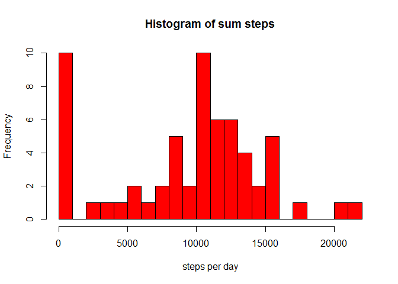
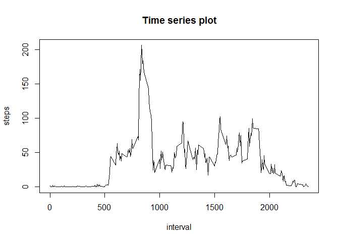
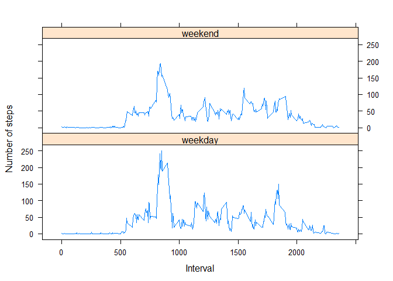

# Reproducible Research: Peer Assessment 1
Xiangbo  
January 8, 2016  


## Basic setting

```r
echo = TRUE  # Always make code visible
options(scipen = 1)  # Turn off scientific notations for numbers
```

## Loading and preprocessing the data
* Load the data

```r
setwd("/Users/Xiangbo/Documents")
AC<-read.csv("activity.csv",sep = ",")
```
* Preprocess data

```r
AC$date<-as.Date(AC$date,"%Y-%m-%d")
```

## What is mean total number of steps taken per day?
* Calculate the total number of steps taken per day

```r
sumSteps<-as.data.frame(tapply(AC$steps, AC$date, sum,na.rm=TRUE))
sumSteps$date<-rownames(sumSteps)
colnames(sumSteps)<-c("steps","date")
rownames(sumSteps)<-1:61
sumSteps$date<-as.Date(sumSteps$date,"%Y-%m-%d")
meanSteps<-mean(sumSteps$steps)
```
* Make a histogram of the total number of steps taken each day

```r
hist(sumSteps$steps,col="red",xlab = "steps per day",main = "Histogram of sum steps",breaks=30)
```

\
* Calculate and report the mean and median

```r
summary(sumSteps)
```

```
##      steps            date           
##  Min.   :    0   Min.   :2012-10-01  
##  1st Qu.: 6778   1st Qu.:2012-10-16  
##  Median :10395   Median :2012-10-31  
##  Mean   : 9354   Mean   :2012-10-31  
##  3rd Qu.:12811   3rd Qu.:2012-11-15  
##  Max.   :21194   Max.   :2012-11-30
```

## What is the average daily activity pattern?
* Make a time series plot of the 5-minute interval (x-axis) and the average number of steps taken, averaged across all days (y-axis)

```r
sumSteps2<-as.data.frame(tapply(AC$steps, AC$interval, mean,na.rm=TRUE))
sumSteps2$interval<-rownames(sumSteps2)
colnames(sumSteps2)<-c("steps","interval")
rownames(sumSteps2)<-1:288
with(sumSteps2,plot(interval,steps,type="l",main="Time series plot"))
```

\
* Which 5-minute interval, on average across all the days in the dataset, contains the maximum number of steps?

```r
sumSteps2[which.max(sumSteps2$steps),]$interval
```

```
## [1] "835"
```

## Imputing missing values
* Devise a strategy for filling in all of the missing values in the dataset. The strategy does not need to be sophisticated. For example, you could use the mean/median for that day, or the mean for that 5-minute interval, etc.
* Create a new dataset that is equal to the original dataset but with the missing data filled in.

```r
newAC<-AC
for(i in 1:length(newAC$steps)){
        if(is.na(newAC[i,1])){
                newAC[i,1]=sumSteps2[sumSteps2$interval==newAC[i,3],1]
        }
}
```
* Make a histogram of the total number of steps taken each day and Calculate and report the mean and and Calculate and report the mean and median total number of steps taken per day.

```r
SumnewAC<-tapply(newAC$steps,newAC$date,sum,na.rm=TRUE)
mean(SumnewAC)
```

```
## [1] 10766.19
```

```r
median(SumnewAC)
```

```
## [1] 10766.19
```

## Are there differences in activity patterns between weekdays and weekends?
* Create a new factor variable in the dataset with two levels - "weekday" and "weekend" indicating whether a given date is a weekday or weekend day.

```r
factor<-function(x){
        if(weekdays(x)<"Saturday"){
                return("weekday")
        }else{
                return("weekend")
        }
}
wfactor<-lapply(newAC$date,factor)
newAC$daytype<-unlist(wfactor)
```
* Make a panel plot containing a time series plot (i.e. type = "l") of the 5-minute interval
(x-axis) and the average number of steps taken, averaged across all weekday days or weekend days (y-axis). See the README file in the GitHub repository to see an example of what this plot should look like using simulated data.

```r
meansteps<-aggregate(steps~interval+daytype,newAC,mean)
library(lattice)
xyplot(steps ~ interval | daytype, data=meansteps, type = "l", layout = c(1, 2), xlab="Interval",ylab="Number of steps")
```

\

